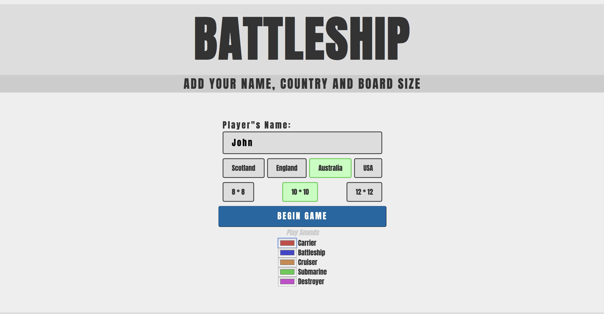
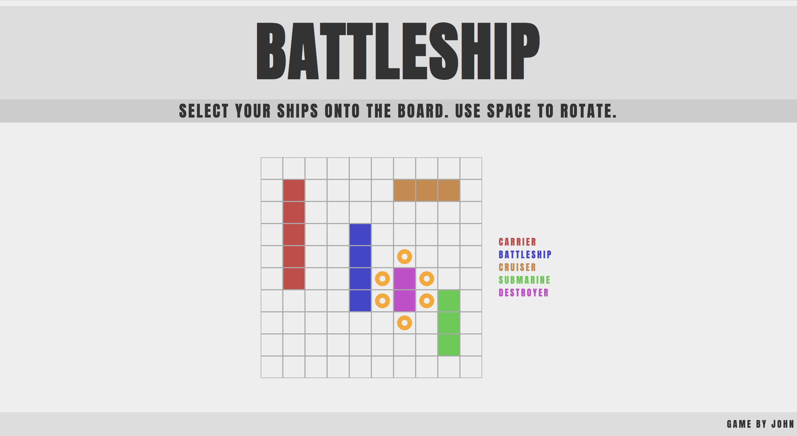
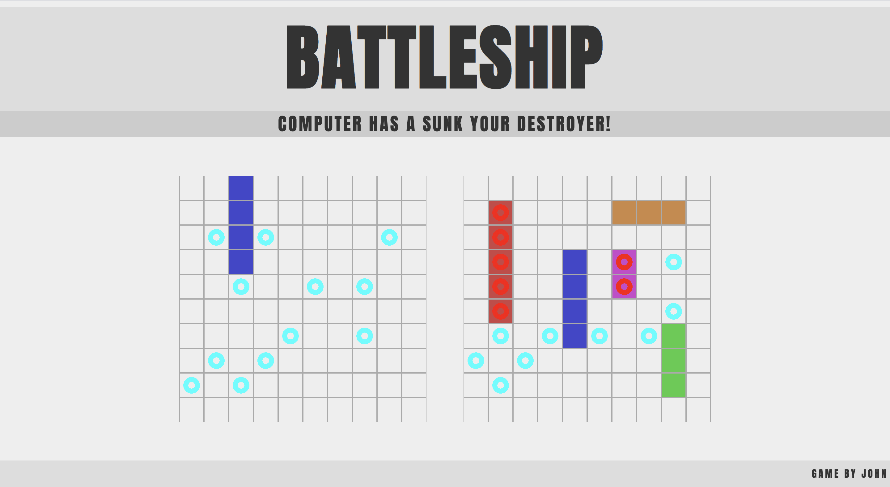

#  Battleship - General Assembly: Project 1

## Overview

Battleship is my browser-based game based on the classic Milton Bradley game. 


## Brief

### Necessary
* The game should be **one player**, with the computer placing its pieces randomly at the start of the game
* The computer should be able to make random attacks on the player's board

### Advanced
* Responsive design
* More **intelligent attacks** by the computer

## Installation

* Clone or download the repo
* Open the `index.html` in your browser of choice

## Deployment

The game is deployed using GitHub Pages and can be found [here](https://jaymagrob.github.io/sei-project-1/).

## Technology Used

* HTML5
* CSS3
* Vanilla JavaScript (ES6)
* Google Fonts
* Git
* GitHub


## Timeframe

Coding was done over 7 days. Deadline for the project was 2pm on the 10th of January 2020.


## Project Overview

### Grid Layout and Start

The two grids are created in JavaScript using an array and DOM manipulation. This is so the user can select whether to play an 8x8, 10x10 or 12x12 game. Instead of hard coding in 64, 100 & 144 squares, they are created in the JavaScript file when needed. To prevent the CSS from messing up the square ratio, the CSS had a variable for grid-item width that’s a percentage that will be pushed to the root as a variable.



#### Player Selection

Player selection was created using 5 event listeners:
* Click on a ship selection button that would pull the variable of what ship had been pressed
* Mouse hovers over a board square showing where the ship could be placed
* Mouse hovers off the board square removing all active ship elements
* Keydown to move the ship in hover mode horizontal or vertical
* Click on a board square to place ship if legal to place there

During this time a method was used to check the surrounding squares:
* Weren’t off the board
* Weren’t ontop another ship
* Weren’t touching another ship



#### Computer Selection

Computer selection was created using a random number generator and a while loop. A forEach loop was used to go through an array of ships longest to shortest. Then a random number would be generated and a coinflip function to decided if it would be horizontal or vertical. It would then be placed on the board with a function called to check it was legally placed. If it was the completed variable would be changed to true, if not it would go back to the while loop and generate another random number.

### Computer AI

Computer AI was generated using three stages:
* **random position** to start where the computer didn't have a hit
* **chase mode** which would be activated once a target had been hit
* **long attack** method which would be activated when two hits happened.

#### Random Position 

A random number was generated from an array all available squares filtering out squares in a chequerboard. As the smallest ship is 2 squares, it was efficient to attack every second square like a chequerboard.

#### Chase Mode

Chase mode had two methods within an object for the competitor. The first **chaseArray** would generate the 4 squares around the **chaseIndex**. The second method would then filter if any of the options were off the board, on the other side of the board, already played. Sort was then used with two Math.random functions to give the array a random order and pick the first one.

```JavaScript
chaseArray: function() {
  return [this.chaseIndex + 1, this.chaseIndex - 1, this.chaseIndex + width, this.chaseIndex - width]
},
removeBoardArray: function() {
  return this.chaseArray()
    .filter(i => i >= 0)
    .filter(i => i < width * width)
    .filter(i => !(i % width === 0 && this.chaseIndex + 1 === i ))
    .filter(i => !(i % width === width - 1 && this.chaseIndex - 1 === i))
    .filter(i => this.competitor.indexOf(i) === -1)
    .sort(() => Math.random() - Math.random())[0]
},
```


## Reflection

### Wins

* With only three weeks of class, I managed to complete a fully functioning web-based game with a computer AI. This improved my confidence in JavaScript as well as my confidence in becoming a programmer.
* The computer AI works logically and can beat humans.
* Computer board is randomly generated every time, which was a daunting task on day one.
* Using CSS variables and root to let the player create their colours.


### Challenges

* Working out how to randomly generate a board for the computer was a difficult task that unearthed unforeseen problems that I had not anticipated when pseudocoding out the process. Each item had to have a randomly generated spot, whether it was vertical or horizontal, not go off the board and not touch or overlap with another ship.  The while loop I used to loop until all these conditions are met did work but it’s not best to practise to run a while loop that is not guaranteed an end.  
* The computer AI was broken for a day while I worked out how to fix an unforeseen error. The AI randomly pick a number into a checkerboard pattern. Once it hits something it targets the four squares around it until it hits again and figures the direction of the boat. This system was breaking when two ships were next to one another. The AI would break because it would hit two ships but only think it had hit one and so would get confused when either side of those two hits didn’t contain a ship and no ship was sunk. After a day of testing and with no clear solution I refactored the game logic to mean that no ship could touch another ship in the setup. Although I would have liked to have found a solution, there was a deadline to finish the project and felt it wasn’t an efficient use of my time.

### Future features

While I am happy with what I created given the assignment and time available, I would like to keep improving my game by implementing the following additions:
* Audio:  although there is an audio button there is no audio. This will be added as an object in the future with a method that’s the first line will be if !music return to make use of the sound button in the selection menu.
* Computer AI: the computer AI can be improved. Currently, the AI is not calculating the gaps between bombs which could be used later in the game to find larger ships.
* Mobile responsive: although the design is mobile responsive the gameplay is not. I need to replace the keystrokes with a button when on a mobile tablet.
* Better explanation of the functions: currently the design is bare and testing has shown that it’s not obvious what the user should do.
* Border radius on the boats: currently the boats are just squares. I want to add a border-radius on the top and bottom square of 5px 0 0 5px and 0 5px 5px 0. This is an issue as there’s already a border being used. The solution is the boats will be child divs within the parent div of each grid square.